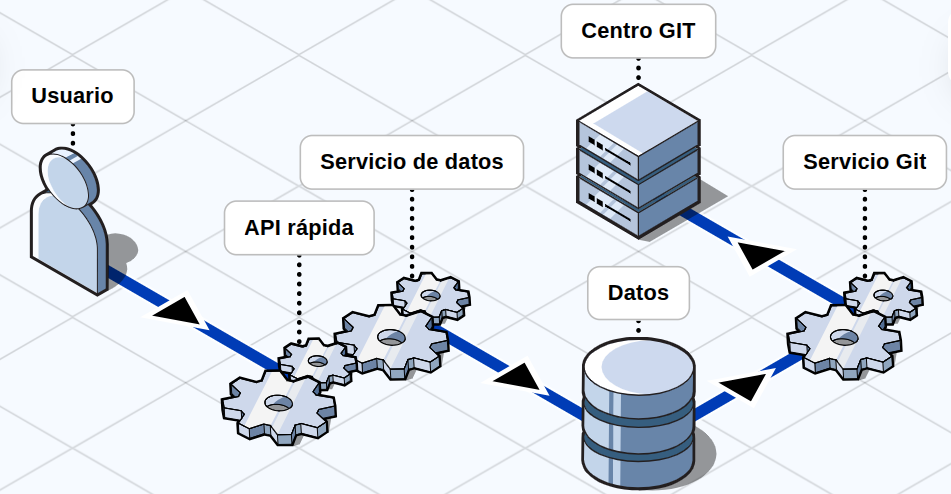

# CommitLens

## El problema

En equipos de desarrollo, información crítica sobre la salud del proyecto vive escondida en el historial de commits y es difícil de analizar sin una herramienta adecuada.

Señales como la concentración de cambios en pocos desarrolladores, archivos modificados constantemente, altos niveles de churn o actividad fuera del horario habitual pueden pasar desapercibidas hasta convertirse en problemas reales.

Las herramientas comerciales que analizan estos patrones pueden ser inaccesibles para equipos pequeños, startups o equipos universitarios. CommitLens busca ofrecer una alternativa open source, self-hosted y desplegable en infraestructura propia.

## La solución

CommitLens es una herramienta open source y autohospedable que analiza el historial de commits de repositorios de GitHub y expone datos y métricas descriptivas sobre la actividad del equipo, el código y la evolución del proyecto.

En lugar de asignar puntuaciones arbitrarias o determinar si un desarrollador es "productivo", CommitLens prioriza mostrar datos objetivos y sus relaciones para que los equipos puedan identificar patrones y sacar sus propias conclusiones.

El sistema está diseñado para ejecutarse mediante contenedores y puede desplegarse en AWS utilizando Terraform, permitiendo reproducir la infraestructura sin depender de una configuración manual.

## Lo que no es

CommitLens no es una herramienta de vigilancia de desarrolladores.

No busca determinar quién es un "mejor" desarrollador, medir productividad individual ni generar rankings.

Tampoco pretende reducir la salud de un proyecto a una única puntuación. Su objetivo es proporcionar datos objetivos y contextualizados sobre la actividad y evolución del proyecto para facilitar el análisis por parte del equipo.

## Qué analiza

### Actividad de contribución

Muestra cómo se distribuyen los cambios entre los desarrolladores:

* Número de commits
* Líneas añadidas
* Líneas eliminadas
* Archivos modificados
* Distribución de actividad entre desarrolladores
* Número de autores por archivo

La herramienta evita utilizar únicamente el número de commits como medida de contribución, ya que un commit puede representar desde un cambio mínimo hasta una modificación extensa.

### Actividad temporal

Permite observar cuándo ocurre el desarrollo:

* Commits por día y semana
* Actividad por hora
* Días activos
* Actividad fuera del horario habitual
* Evolución de la actividad a lo largo del tiempo

### Code churn

Mide el volumen de cambios realizados sobre el código:

* Líneas añadidas
* Líneas eliminadas
* Churn total
* Churn por desarrollador
* Churn por archivo
* Churn por período

### Archivos y hotspots

Permite identificar archivos con alta actividad y observar diferentes dimensiones de sus cambios:

* Frecuencia de modificación
* Líneas añadidas y eliminadas
* Número de autores
* Última modificación
* Historial de cambios

Los hotspots se presentan principalmente como datos observables, evitando convertir automáticamente cualquier archivo muy modificado en un supuesto "riesgo".

### Código inactivo

Identifica partes del repositorio con poca o ninguna actividad:

* Tiempo desde la última modificación
* Actividad histórica
* Archivos que nunca o casi nunca se modifican

Se podrán excluir archivos generados, dependencias y otros elementos que no representen código mantenido directamente por el equipo.

### Tamaño de los cambios

Analiza el tamaño de los cambios realizados:

* Líneas modificadas por commit
* Archivos modificados por commit
* Tamaño promedio
* Tamaño mediano
* Percentiles
* Distribución de tamaños

Esto permite contextualizar métricas como frecuencia de commits y actividad de los desarrolladores.

### Mensajes de commit

Analiza características de los mensajes de commit:

* Longitud
* Mensajes genéricos o poco descriptivos
* Distribución de tipos de commit
* Adopción de convenciones como Conventional Commits

### Evolución histórica

Las métricas pueden agruparse por períodos para observar cómo cambia el proyecto:

* Actividad
* Churn
* Distribución de contribución
* Archivos modificados
* Tamaño de los cambios
* Actividad temporal

El objetivo es mostrar tendencias sin asumir automáticamente que una tendencia representa un problema.

## Para quién es

* Engineering managers y tech leads que necesitan visibilidad sobre la actividad y evolución de sus proyectos.
* Equipos open source que quieren analizar sus repositorios.
* Organizaciones que no quieren enviar sus datos de desarrollo a servicios externos.
* Equipos universitarios y pequeños equipos que buscan una alternativa open source.

## Por qué open source y self-hosted

Los datos derivados del historial de Git pueden revelar información sensible sobre un equipo: quién modifica determinadas partes del sistema, cómo evoluciona el proyecto y cuándo se desarrolla actividad.

CommitLens está diseñado para ejecutarse dentro de la infraestructura del equipo. La aplicación puede ejecutarse localmente mediante Docker o desplegarse en AWS mediante Terraform.

## Arquitectura Macro

EL siguiente gráfico detalla el sistema en alta escala:

## Infraestructura

La infraestructura forma parte fundamental del proyecto.

* Docker para contenerización.
* Docker Compose para ejecución local.
* Terraform como Infrastructure as Code.
* AWS como plataforma de despliegue.
* PostgreSQL para almacenamiento histórico.
* Redis para caché.
* GitHub REST API y GraphQL API como fuentes de datos.

## Stack técnico

* **Backend:** Python + FastAPI
* **Análisis:** Pandas
* **Base de datos:** PostgreSQL
* **Caché:** Redis
* **Fuente de datos:** GitHub REST API + GraphQL API
* **Contenedores:** Docker + Docker Compose
* **Infrastructure as Code:** Terraform
* **Cloud:** AWS

## Futuras métricas

A partir de los datos recopilados, podrían incorporarse posteriormente métricas derivadas como:

* Bus Factor
* Hotspot Score
* Detección de anomalías
* Métricas de Pull Requests
* Métricas de Issues
* Indicadores de riesgo técnico

Estas métricas se incorporarían únicamente cuando exista una definición clara y justificable de cómo calcularlas.
