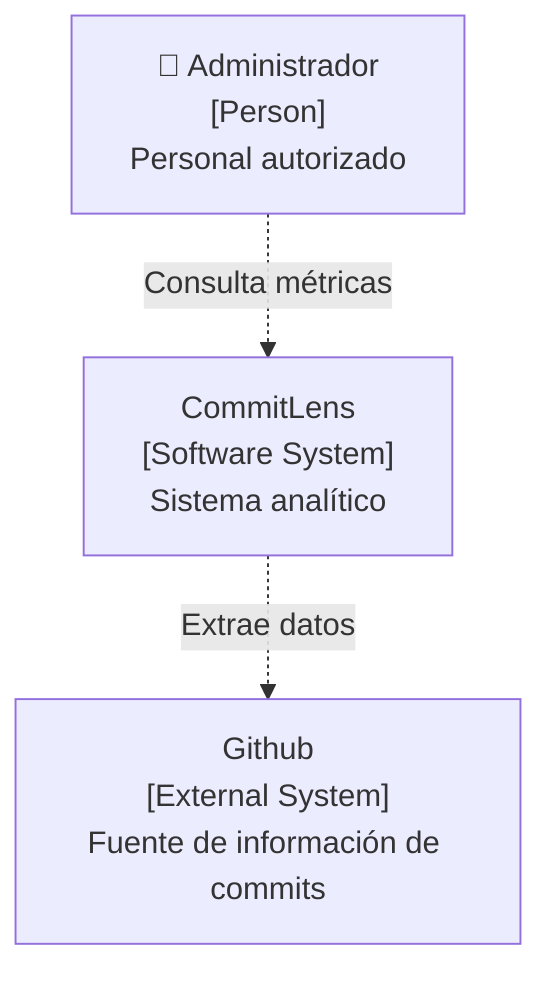
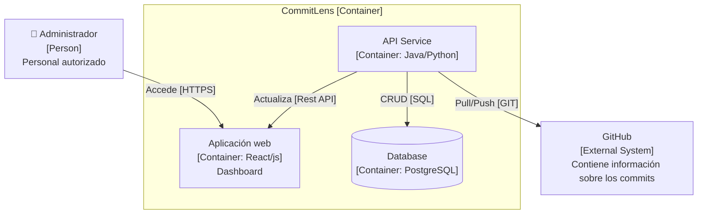
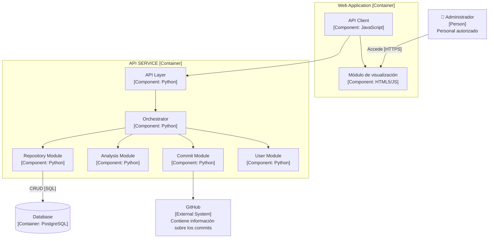

# 01. Arquitectura y Decisiones Tecnológicas

## Modelo C4: Nivel 1 (Contexto)

## Modelo C4: Nivel 2 (Contenedores)

## Modelo C4: Nivel 3 (Componentes)

## Decisiones Tecnológicas (Stack Justificado)

* **FastAPI:** Elegido por su soporte asíncrono nativo para gestionar peticiones lentas de clonado y análisis de código sin degradar el rendimiento.
* **Pandas:** Utilizado para vectorizar y agregar el cálculo de métricas de código de forma significativamente más rápida que bucles nativos en Python.
* **PostgreSQL + Redis:** Estrategia de dos capas. Redis actúa como caché de respuesta rápida (repositorios ya analizados) y PostgreSQL como almacenamiento persistente estructurado.
* **Git CLI nativo:** Evita bloqueos por cuotas/límites en las APIs REST de proveedores de Git y otorga flexibilidad total para extraer históricos mediante `git log`.
* **Docker + Terraform + AWS:** Combinación estandarizada para portabilidad en contenedores, aprovisionamiento automatizado y escalabilidad en la nube.