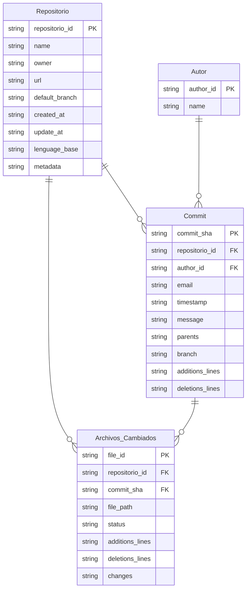
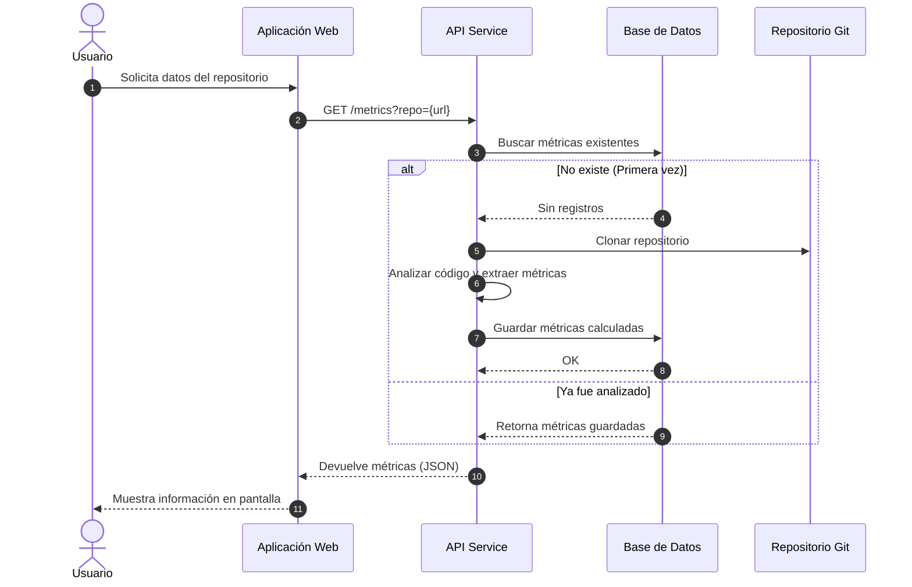

# 02. Modelo de Datos y Flujo de Información

## Modelo Entidad-Relación (ER)

```mermaid
erDiagram
    Repositorio ||--o{ Commit : ""
    Repositorio ||--o{ Archivos_Cambiados : ""
    Commit ||--o{ Archivos_Cambiados : ""
    Autor ||--o{ Commit : ""

    Repositorio {
        string repositorio_id PK
        string name
        string owner
        string url
        string default_branch
        string created_at
        string update_at
        string lenguage_base
        string metadata
    }

    Autor {
        string author_id PK
        string name
    }

    Commit {
        string commit_sha PK
        string repositorio_id FK
        string author_id FK
        string email
        string timestamp
        string message
        string parents
        string branch
        string additions_lines
        string deletions_lines
    }

    Archivos_Cambiados {
        string file_id PK
        string repositorio_id FK
        string commit_sha FK
        string file_path
        string status
        string additions_lines
        string deletions_lines
        string changes
    }
```

## flujo de datos

```mermaid
sequenceDiagram
    autonumber
    actor U as Usuario
    participant WA as Aplicación Web
    participant API as API Service
    participant DB as Base de Datos
    participant GH as Repositorio Git

    U->>WA: Solicita datos del repositorio
    WA->>API: GET /metrics?repo={url}
    API->>DB: Buscar métricas existentes

    alt No existe (Primera vez)
        DB-->>API: Sin registros
        API->>GH: Clonar repositorio
        API->>API: Analizar código y extraer métricas
        API->>DB: Guardar métricas calculadas
        DB-->>API: OK
    else Ya fue analizado
        DB-->>API: Retorna métricas guardadas
    end

    API-->>WA: Devuelve métricas (JSON)
    WA-->>U: Muestra información en pantalla
```